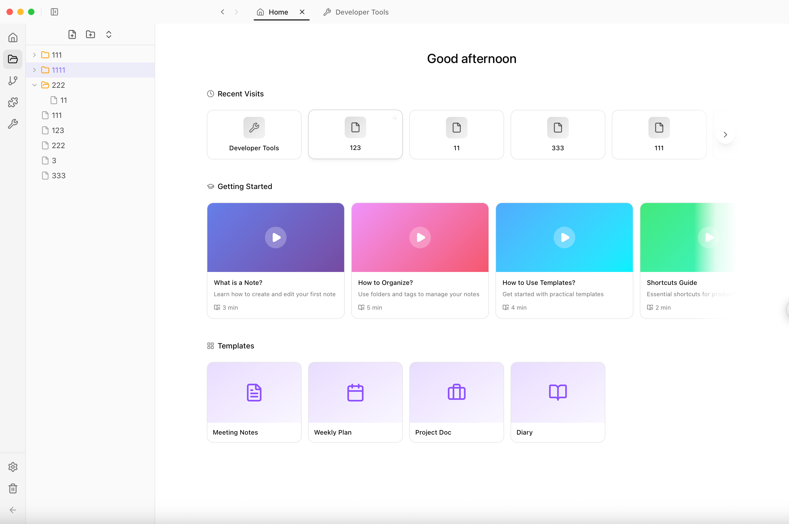
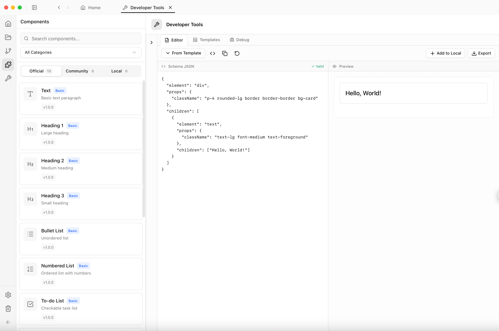

<div align="center">


# LoreNote

### The JSON-Driven Note-Taking App

**"Component is Page, Page is Component"**

[]()
[]()
[](https://tauri.app)
[](https://react.dev)

**[中文](README_CN.md)** | English

<br/>



<br/><br/>



</div>

---

## About

LoreNote is a modern desktop note-taking application with a unique approach: **every block is defined by JSON Schema, not hardcoded components**.

> *Inspired by Notion's block-based editing and Obsidian's local-first philosophy, powered by modern web technologies.*

---

## Core Concept: JSON Components

### The Problem with Traditional Note Apps

```tsx
// ❌ Traditional: Every component requires developer code
function TableBlock({ data }) {
  return (
    <table>
      {data.rows.map(row => (
        <tr key={row.id}>
          {row.cells.map(cell => (
            <td key={cell.id}>{cell.content}</td>
          ))}
        </tr>
      ))}
    </table>
  )
}

// Want a new component? Wait for developers to release an update...
```

### LoreNote's Solution

```json
{
  "element": "table",
  "data": { "rows": [...], "hasHeader": true },
  "children": [{
    "element": "tr",
    "loop": { "items": "data.rows", "itemName": "row" },
    "children": [{
      "element": "td",
      "loop": { "items": "row.cells", "itemName": "cell" },
      "props": { "contentEditable": true },
      "events": { "input": "data.rows[rowIndex].cells[cellIndex].content = event.target.innerText" },
      "children": ["${cell.content}"]
    }]
  }]
}
```

**Zero TSX. Pure JSON. Full Interactivity.**

---

## Why This Matters

### 1. Infinite Extensibility

| Traditional Apps | LoreNote |
|-----------------|----------|
| Components decided by dev team | Users define their own components |
| New features require version updates | Write JSON, use immediately |
| High coding barrier | Just understand JSON structure |

### 2. Community Creation Ecosystem

```
User A creates a "Habit Tracker" component
    ↓
Export as habit-tracker.json (only 2KB)
    ↓
Share to community / Send to friends
    ↓
User B imports, ready to use
    ↓
User B modifies styles, creates own version
```

**No plugins to install. No review process. No coding required.**

### 3. AI Friendly

```
User: Help me create a project progress tracker

AI: Sure, here's the component JSON...
{
  "element": "div",
  "data": { "tasks": [], "progress": 0 },
  ...
}

User: Copy → Paste → Done
```

**JSON is the format AI excels at generating.** LoreNote will deeply integrate AI workflows, making component creation even simpler.

### 4. Full Interactive Capabilities

JSON Schema is not a simplified version - it supports complete interactive logic:

| Capability | Example |
|------------|---------|
| Data Binding | `${data.title}` |
| Conditional Rendering | `"condition": "data.count > 0"` |
| Loop Rendering | `"loop": { "items": "data.list" }` |
| Event Handling | `"events": { "click": "data.count++" }` |
| Computed Expressions | `${data.items.reduce((s,i) => s + i.price, 0)}` |
| Conditional Styles | `"conditional": [{ "condition": "...", "className": "..." }]` |

---

## Tech Stack

<table>
<tr>
<td align="center" width="100">
<strong>React 19</strong><br/>Frontend
</td>
<td align="center" width="100">
<strong>Tauri 2</strong><br/>Desktop
</td>
<td align="center" width="100">
<strong>Tailwind 4</strong><br/>Styling
</td>
<td align="center" width="100">
<strong>Shadcn UI</strong><br/>Components
</td>
<td align="center" width="100">
<strong>Zustand</strong><br/>State
</td>
</tr>
</table>

---

## Features

### v0.2.0-beta (Current)

<details open>
<summary><strong>Core Features</strong></summary>

| Feature | Description |
|---------|-------------|
| Vault System | Multi-vault support with metadata management |
| Page Management | Create, edit, delete pages with virtual folders |
| Block Editor | Slash command `/` driven block creation |
| V8 Render Engine | JSON Schema driven, strict unidirectional data flow |
| Wiki Links | `[[Page Name]]` syntax with hover preview |
| Theme | Light / Dark mode with semantic colors |
| i18n | Chinese / English language switching |
| Trash | Soft delete with restore capability |
| Tabs | Multi-tab browsing with history |

</details>

<details open>
<summary><strong>Block Types</strong></summary>

| Category | Blocks |
|----------|--------|
| Basic | Text, Heading (H1-H3), Divider |
| List | Bullet, Numbered, Todo, Radio, Checkbox |
| Media | Image, Video, Audio, File, Code Block |
| Layout | Quote, Callout, Toggle |
| Data | Table, Price Calculator |
| Links | Page Link, Web Link, Bookmark |

</details>

<details>
<summary><strong>Developer Tools</strong></summary>

| Tool | Description |
|------|-------------|
| Schema Editor | Live JSON editing with real-time preview |
| Template Library | Pre-built component templates |
| Debug Console | Expression, event, state logging |
| Documentation | Schema syntax reference & tutorials |

</details>

---

## Roadmap

```
v0.2.0 ──────────────────────────────────────────────────────── NOW
   │
   │   Knowledge Graph, Wiki Links, Backlinks
   │
v0.3.0 ─────────────────────────────────────────────────────── NEXT
   │
   │   Community Marketplace
   │   ├─ Component Sharing - Share custom components
   │   ├─ One-Click Install - Browse and install instantly
   │   └─ Ratings & Reviews - Community feedback
   │
v0.4.0 ──────────────────────────────────────────────────────────
   │
   │   Cloud Sync
   │   ├─ End-to-End Encryption
   │   └─ Cross-Device Sync
   │
v0.5.0 ──────────────────────────────────────────────────────────
   │
   │   Mobile Expansion
   │   ├─ iOS App - iPhone / iPad
   │   └─ Android App
   │
v1.0.0 ──────────────────────────────────────────────────────────
   │
   │   Vibe Coding (AI Workflow)
   │   ├─ AI Component Generation
   │   └─ Natural Language Interface
   │
   ▼
```

---

## For Developers

### Prerequisites

Before you begin, ensure you have the following installed:

- **Node.js** 18+ ([Download](https://nodejs.org))
- **pnpm** ([Install](https://pnpm.io/installation))
- **Rust** ([Install](https://www.rust-lang.org/tools/install))
- **System Dependencies** (for Tauri):
  - **macOS**: Xcode Command Line Tools
  - **Linux**: `build-essential`, `libwebkit2gtk-4.0-dev`, `libssl-dev`, `libgtk-3-dev`, `libayatana-appindicator3-dev`, `librsvg2-dev`
  - **Windows**: Microsoft Visual Studio C++ Build Tools

### Quick Start

```bash
# Clone the repository
git clone https://github.com/yourusername/lore-note.git
cd lore-note

# Install dependencies
pnpm install

# Run development server (with hot reload)
pnpm run tauri dev

# Build for production
pnpm run tauri build
```

### Available Commands

| Command | Description |
|---------|-------------|
| `pnpm install` | Install all dependencies |
| `pnpm run tauri dev` | Start development server with Tauri |
| `pnpm run tauri build` | Build production app for your platform |
| `pnpm dev` | Start Vite dev server only (frontend) |
| `pnpm build` | Build frontend only |
| `pnpm tsc --noEmit` | Run TypeScript type checking |

### Project Structure

```
lore-note/
├── src/                    # Frontend source code
│   ├── components/         # React components
│   ├── engine-v8/          # JSON Schema render engine
│   ├── features/           # Feature modules
│   ├── services/           # Business logic layer
│   ├── stores/             # Zustand state management
│   └── types/              # TypeScript type definitions
├── src-tauri/              # Tauri backend (Rust)
│   ├── src/                # Rust source code
│   ├── icons/              # App icons
│   └── capabilities/       # Tauri permissions
├── public/                 # Static assets
└── package.json            # Dependencies & scripts
```

### Contributing

We welcome contributions! Please feel free to submit issues and pull requests.

---

## Documentation

For detailed JSON Schema syntax, expression system, and component development guide:

**[LoreNote Docs →](https://github.com/user/lorenote-docs)**

---

## License

Distributed under the AGPLv3 License. See [LICENSE.md](LICENSE.md) for more information.

---

<div align="center">

Inspired by [Notion](https://notion.so), [Obsidian](https://obsidian.md) & [AppFlowy](https://appflowy.io)

</div>
